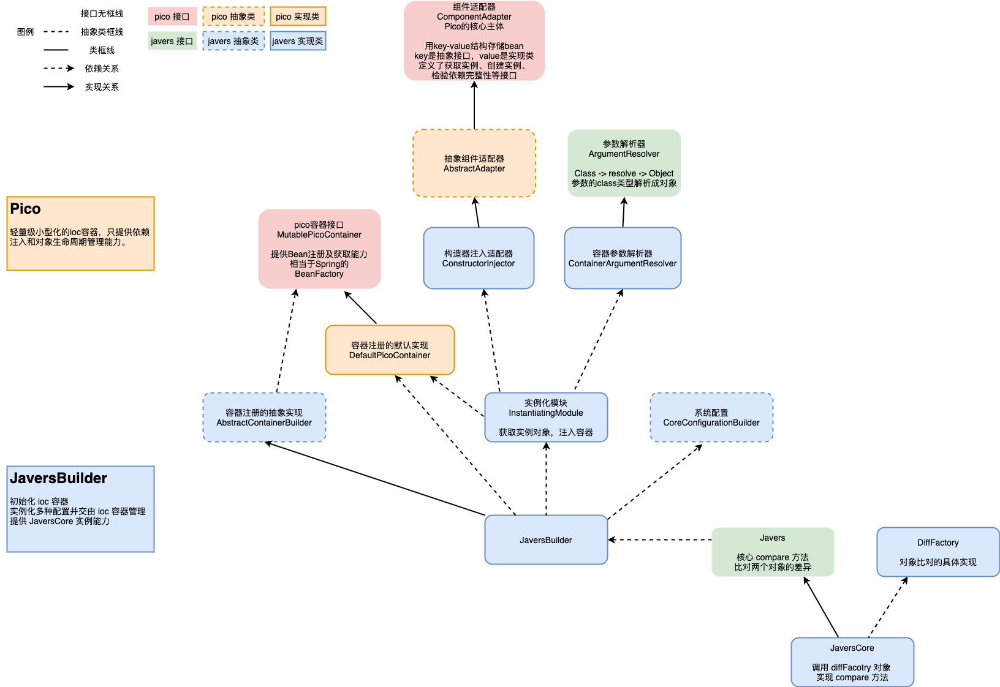

# Javers IOC 分析

Javers采用 Pico 作为 IOC 框架

本文从以下方面分析 Javers 是如何跟 Pico 结合的

1. Pico 提供了哪些能力
2. Javers 在什么时机往 IOC 容器注入 Bean，过程是怎么样的
3. Javers 注入了哪些 Bean 承担了哪些功能

## 依赖概览

我们来大致浏览一下 Javers 的核心建造器 JaversBuilder 是如何使用 IOC 容器的

### Pico Container

轻量级的ioc容器，只提供依赖注入和对象生命周期管理能力

MutablePicoContainer: Bean 注册、依赖注入、生命周期管理的定义接口，作用类似于 Spring 的 BeanFacotry

DefaultPicoContainer：MutablePicoContainer的标准实现类，通过 HashMap 结构存储接口与实现类的对应关系，key 是接口，
value是实现类,如"IUserSerivce.class":"UserServiceImpl.class"

ComponentAdapter

* *getComponentKey()*：获得PicoContainer里面的key
* *getComponentImplementation()*：获得实现类
* *getComponentInstance(PicoContainer container)*：生成一个实例

### Javers 与 Pico Container 相关的实现

AbstractContainerBuilder：这是一个抽象类，直接依赖了 MutablePicoContainer 接口作为成员变量，并在容器初始化方法 *
bootContainer()* 直接 new DefaultPicoContainer 对象完成成员变量 mutablePicoContainer 的初始化。

ContainerArgumentResolver：依赖 PicoContainer 的能力，提供根据传入类型获取对象实例的能力。

InstantiatingModule：依赖 ContainerArgumentResolver 将实例注册进容器，并注册三个基础
Bean：GlobalIdFactory、JsonConverterBuilder、JaversCore

JaversCore： 依赖 JaversFactory 实现对象比较的能力。

JaversBuilder：建造者模式的 Javers 对象构造器

* *JaversBuilder Javers()* ：在构造方法中 new 并返回自身
* *withListCompareAlgorithm(ListCompareAlgorithm algorithm)* ：对象比较策略的构造器装配
* *Javers assembleJaversInstance()* ：往 IOC 容器中注册各类功能模块，并返回 Javers 的实例对象

## Javers 注入了哪些 Bean

// TODO