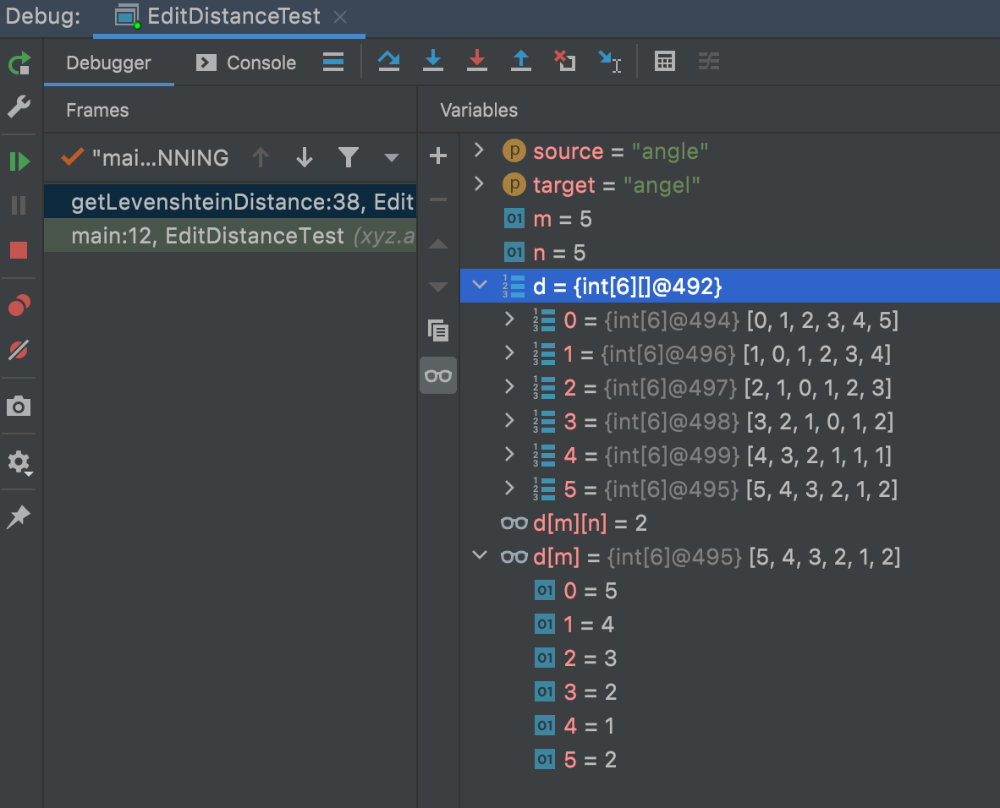

# Levenshten Distance 算法之一 计算距离

列文斯泰因（ 提出者，俄罗斯籍科学家 ）距离，又称为编辑距离。

指两个字符串之间，由前者转换成后者所需要的最少编辑次数。

如果两者的距离越大，则说明两者越是不同。

编辑操作包括，替换、 插入 、 删除。

## 入门例子

例如将 duck 转换成 docker ：

    * dock  （ o 替换 u ）
    * docke （ 末尾添加 e ）
    * docker（ 末尾添加 r ）

需要变更三次，距离 = 3

字符相似度 = 1 - 3 / Math.Max(duck.length,docker.length) = 0.5

## 算法过程

1.「变量标记」str1 ｜ str1.length = n ｜ str2 ｜ str2.length = m ｜ temp ｜ 矩阵d

2.「边界」前后两者存在一个 length = 0 ，则另一个不为零的字符串长度。

3.「初始化」初始化矩阵 d ，空间大小 ( n + 1 ) * (m + 1) 。

4.「遍历对比」扫描 str1 与 str2 ，如果 str1[i] == str2[j] , 则 temp = 0，否则 temp = 1。

5.「矩阵赋值」d[i,j] 取 d[i-1,j] + 1 ，d[i,j-1] + 1 ，d[i-1,j-1] + temp 三个值中的最小值。

6.「计算距离」矩阵的 d[n,m] 值就是 str1 与 str2 的距离

7.「相似度公式」1 - d[n,m] / Math.Max(str1.length,str2.length)

## 图解算法

1.使用 angle 和 angel 两个单词来观察矩阵变化
<table border="1">
<tr>
<td></td>
<td></td>
<td>a</td>
<td>n</td>
<td>g</td>
<td>l</td>
<td>e</td>
</tr>
<tr>
<td></td>
<td>0</td>
<td>1</td>
<td>2</td>
<td>3</td>
<td>4</td>
<td>5</td>
</tr>
<tr>
<td>a</td>
<td>1</td>
<td >待定值</td>
<td></td>
<td></td>
<td></td>
<td></td>
</tr>
<tr>
<td>n</td>
<td>2</td>
<td></td>
<td></td>
<td></td>
<td></td>
<td></td>
</tr>
<tr>
<td>g</td>
<td>3</td>
<td></td>
<td></td>
<td></td>
<td></td>
<td></td>
</tr>
<tr>
<td>e</td>
<td>4</td>
<td></td>
<td></td>
<td></td>
<td></td>
<td></td>
</tr>
<tr>
<td>l</td>
<td>5</td>
<td></td>
<td></td>
<td></td>
<td></td>
<td></td>
</tr>
</table>

2.待定值的取值公式

temp = str1[i] == str2[j] ? 0 : 1

d[i,j] = Math.Min(d[i-1,j] + 1 ，d[i,j-1] + 1 ，d[i-1,j-1] + temp)

<table border="1">
<tr>
<td></td>
<td></td>
<td>a</td>
<td>n</td>
<td>g</td>
<td>l</td>
<td>e</td>
</tr>
<tr>
<td></td>
<td bgcolor=#ec2d7a>0</td>
<td bgcolor=#ec2d7a>1</td>
<td>2</td>
<td>3</td>
<td>4</td>
<td>5</td>
</tr>
<tr>
<td>a</td>
<td bgcolor=#ec2d7a>1</td>
<td bgcolor=#7FFFD4> d[i-1,j] + 1 = 2，
d[i,j-1] + 1 = 2，
d[i-1,j-1] + temp = 0 
因此取0</td>
<td></td>
<td></td>
<td></td>
<td></td>
</tr>
<tr>
<td>n</td>
<td>2</td>
<td></td>
<td></td>
<td></td>
<td></td>
<td></td>
</tr>
<tr>
<td>g</td>
<td>3</td>
<td></td>
<td></td>
<td></td>
<td></td>
<td></td>
</tr>
<tr>
<td>e</td>
<td>4</td>
<td></td>
<td></td>
<td></td>
<td></td>
<td></td>
</tr>
<tr>
<td>l</td>
<td>5</td>
<td></td>
<td></td>
<td></td>
<td></td>
<td></td>
</tr>
</table>

3.以此类推完成这张表

<table border="1">
<tr>
<td></td>
<td></td>
<td>a</td>
<td>n</td>
<td>g</td>
<td>l</td>
<td>e</td>
</tr>
<tr>
<td></td>
<td>0</td>
<td>1</td>
<td>2</td>
<td>3</td>
<td>4</td>
<td>5</td>
</tr>
<tr>
<td>a</td>
<td>1</td>
<td>0</td>
<td>1</td>
<td>2</td>
<td>3</td>
<td>4</td>
</tr>
<tr>
<td>n</td>
<td>2</td>
<td>1</td>
<td>0</td>
<td>1</td>
<td>2</td>
<td>3</td>
</tr>
<tr>
<td>g</td>
<td>3</td>
<td>2</td>
<td>1</td>
<td>0</td>
<td>1</td>
<td>2</td>
</tr>
<tr>
<td>e</td>
<td>4</td>
<td>3</td>
<td>2</td>
<td>1</td>
<td>1</td>
<td>1</td>
</tr>
<tr>
<td>l</td>
<td>5</td>
<td>4</td>
<td>3</td>
<td>2</td>
<td>1</td>
<td bgcolor=#7FFFD4>2</td>
</tr>
</table>

4.得到他们的距离为 2 ，相似度为 1 - 2 / 5 = 0.6

## 算法实现

```java
    public static int getLevenshteinDistance(String source,String target){
        int m = source.length() , n = target.length() ,temp;
        if ( m == 0 ){
            return n ;
        }
        if ( n == 0 ){
            return m ;
        }
        int[][] d = new int[m+1][n+1];
        // init d[?][0]
        for (int i = 0 ; i< m+1 ; i ++){
            d[i][0] = i;
        }
        for (int j = 0 ; j< n+1 ; j ++){
            d[0][j] = j;
        }

        for( int i = 1 ; i < m+1  ; i ++ ){
            for ( int j = 1 ; j < n+1 ; j ++ ){
                temp = source.charAt(i-1) == target.charAt(j-1) ? 0 : 1;
                d[i][j] = Math.min(Math.min(d[i-1][j]+1,d[i][j-1]+1),d[i-1][j-1]+temp);
            }
        }
        return d[m][n];
    }
```

## 测试

