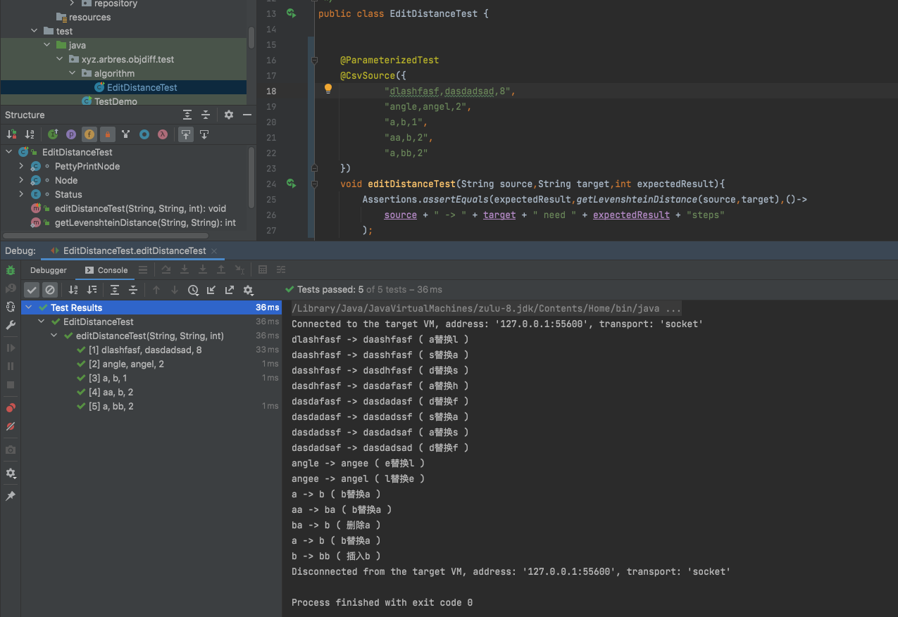

# Levenshten Distance 算法之二 输出过程

第一节实现了最短编辑距离的计算，本节实现最短编辑距离的最小操作输出。

## 扩展节点 - 记录操作信息

将原本的 int[][] 矩阵升级成 Node[][] 矩阵

weight 权重，用来存储距离

status 记录每条路径的修改状态

```java
enum Status {
    UNSET("未设置"),
    RETAINED("不变"),
    INSERTED("插入"),
    REMOVED("删除"),
    REPLACED("替换");

    private final String name;

    Status(String name) {
        this.name = name;
    }

    public String getName() {
        return name;
    }
}

static class Node {
    private int weight; 
    private Status status;

    private Node() {
    }

    public Node(int val, Status status) {
        this.weight = val;
        this.status = status;
    }

    @Override
    public String toString() {
        return "Node{" +
                "val=" + weight +
                ", status=" + status +
                '}';
    }
}
```

## 反向寻找最短路径

矩阵终点 Node[m][n] 存储了最佳操作路径的最终操作 Status。

终点 Node[m][n] 根据可以根据Status的值反推出最短路径到起点 Node[0][0]，构建队列。

由于队列是逆序存储，更适合采用栈的形式反序输出。

PettyPrintNode用来存储最短路径打印节点的信息

```java
static class PettyPrintNode {

    private Character newChar; // 存储新字符
    private Character oldChar; // 存储旧字符
    private String stepTarget; // 替换了新字符后的目标状态
    private String stepSource; // 当前包含旧字符下的状态
    private Status status;     // 状态操作

    public void setNewChar(Character newChar) {
        this.newChar = newChar;
    }

    public void setOldChar(Character oldChar) {
        this.oldChar = oldChar;
    }

    public void setStepTarget(String stepTarget) {
        this.stepTarget = stepTarget;
    }

    public void setStepSource(String stepSource) {
        this.stepSource = stepSource;
    }

    public void setStatus(Status status) {
        this.status = status;
    }

    @Override
    public String toString() {
        String string = "";
        switch (status) {
            case INSERTED:
                string = stepSource + " -> " + stepTarget + " ( " + status.getName() + newChar + " ) ";
                break;
            case REMOVED:
                string = stepSource + " -> " + stepTarget + " ( " + status.getName() + oldChar + " ) ";
                break;
            case REPLACED:
                string = stepSource + " -> " + stepTarget + " ( " + newChar + status.getName() + oldChar + " ) ";
                break;
        }
        return string;
    }
}

private static void buildNodeOptList(Node[][] nodeTable, String source, String target, int sourceLen, int targetLen) {
    Deque<PettyPrintNode> pettyPrintNodeList = new LinkedList<>();
    String trace = target;
    char[] sourceChars = source.toCharArray();
    char[] targetChars = target.toCharArray();
    for (int i = sourceLen; i > 0; ) {
        for (int j = targetLen; j > 0; ) {
            PettyPrintNode pettyPrintNode = new PettyPrintNode();
            pettyPrintNode.setStatus(nodeTable[i][j].status);
            switch (nodeTable[i][j].status) {
                case INSERTED:
                    pettyPrintNode.setNewChar(targetChars[j - 1]);
                    pettyPrintNode.setStepTarget(trace);
                    int traceLen = trace.length();
                    trace = trace.substring(0, j - 1) + trace.substring(j, traceLen);
                    pettyPrintNode.setStepSource(trace);
                    pettyPrintNodeList.push(pettyPrintNode);
                    j = j - 1;
                    break;
                case REMOVED:
                    pettyPrintNode.setOldChar(sourceChars[i - 1]);
                    pettyPrintNode.setStepTarget(trace);
                    trace = trace + sourceChars[i - 1];
                    pettyPrintNode.setStepSource(trace);
                    pettyPrintNodeList.push(pettyPrintNode);
                    i = i - 1;
                    break;
                case RETAINED:
                    i = i - 1;
                    j = j - 1;
                    break;
                case REPLACED:
                    pettyPrintNode.setOldChar(sourceChars[i - 1]);
                    pettyPrintNode.setNewChar(targetChars[j - 1]);
                    pettyPrintNode.setStepTarget(trace);
                    trace = new StringBuilder(trace).replace(j - 1, j, String.valueOf(sourceChars[i - 1])).toString();
                    pettyPrintNode.setStepSource(trace);
                    pettyPrintNodeList.push(pettyPrintNode);
                    i = i - 1;
                    j = j - 1;
                    break;
            }
        }
    }
    while (pettyPrintNodeList.size() > 0) {
        PettyPrintNode pop = pettyPrintNodeList.pop();
        System.out.println(pop);
    }
}
 
```


## 单元测试

采用 junit5 进行单元测试




